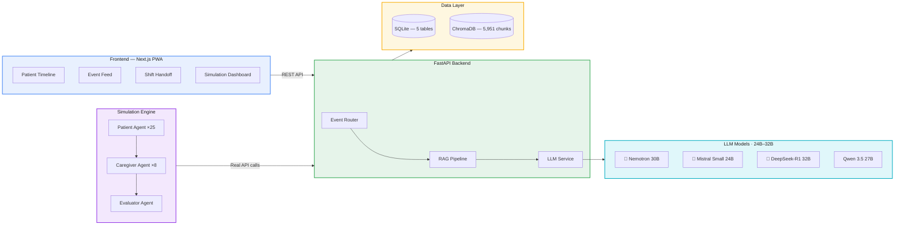

# 🏥 CareLoop AI

### Multi-Agent Simulation & Evaluation Framework for Evidence-Based Nursing Home Care

[](https://memowell-next-production.up.railway.app)
[](https://memowell-next-production.up.railway.app/simulation)
[]()
[](LICENSE)

> **CareLoop** is a multi-agent AI system that simulates a memory care facility with 25 AI patients and 8 AI caregivers, parses clinical behavioral events, matches evidence-based protocols via RAG, and recommends interventions in real time — with zero hallucination by design.

---

## 🎬 Demo Video

[](https://github.com/GuilinDev/memowell-ai/raw/main/docs/assets/careloop-demo.mp4)

> 📺 *GIF preview auto-plays above — [click for full 50s video](https://github.com/GuilinDev/memowell-ai/raw/main/docs/assets/careloop-demo.mp4) with audio. Three acts: critical event → 25-patient parallel simulation → metrics dashboard.*

---

## 🏥 Virtual Nursing Home — Agent Simulation


> **Legend:**
> | Symbol | Meaning |
> |--------|---------|
> | 🔴 Red circle (smile) | Patient — calm |
> | 🔴 Red circle + ⚠️ + pulsing ring | Patient — **agitated** (sundowning, anxiety, etc.) |
> | 🟤 Dim circle + `zzZ` | Patient — **sleeping** |
> | 🟣 Purple ring + 💊 | Patient — **receiving care** from a caregiver |
> | 🟠 Orange circle + ❓ | Patient — **wandering** |
> | 🔵 Blue circle + white cross | **Caregiver** — patrolling |
> | 🔵 Blue circle + 🚨 + yellow ring | **Caregiver** — responding to an event |
> | 🟢 Green circle | **Caregiver** — actively intervening |
> | Colored tag below agent | **Behavioral event** just triggered (e.g. "anxiety", "refusal") |
>
> *25 AI patients × 8 AI caregivers, Day Shift 07:00→15:00, 51 events across 16 time steps.*

---

### 🧠 Agent Architecture

Our simulation is inspired by [Generative Agents](https://arxiv.org/abs/2304.03442) (Stanford, UIST 2023), [ACE](https://arxiv.org/abs/2501.09688) (Stanford, 2025), and [ScalingEval](https://arxiv.org/abs/2502.14499) (NeurIPS 2025 Workshop).

#### Patient Agents (25 residents)

Each patient has a **rich profile** with clinical history that drives behavior:

```json
{
  "name": "Margaret Chen",
  "age": 82,
  "diagnosis": "Alzheimer's Disease",
  "stage": "moderate",
  "personality": "Former school principal. Dignified, organized, becomes anxious when routine is disrupted.",
  "medical_history": ["hypertension", "osteoporosis", "type 2 diabetes"],
  "medications": ["donepezil", "lisinopril", "metformin"],
  "common_behaviors": ["sundowning", "refusal_to_eat", "repetitive_questions"],
  "triggers": ["routine_change", "loud_noise", "unfamiliar_people"],
  "effective_interventions": ["music_therapy", "photo_album", "structured_routine"],
  "mobility": "ambulatory_with_walker",
  "diet": "soft_food",
  "notes": "Responds well to classical music. Daughter visits Sundays."
}
```

**Behavior triggering** follows a 4-layer probability model:

| Layer | Mechanism | Example |
|-------|-----------|---------|
| 1. Time-of-day weights | Base probability per behavior per time period | Sundowning: morning 0%, evening 70% |
| 2. Dementia stage modifier | Severe = 1.5×, moderate = 1.0×, mild = 0.5× | Severe patient → 70% × 1.5 = capped at 95% |
| 3. Environmental triggers | Boost when trigger conditions match | Routine change at shift change → ×1.5 |
| 4. Intervention memory | Recent successful intervention reduces probability | Resolved in last 3 events → ×0.3 |

25 distinct behavior types are modeled, including sundowning, wandering, exit-seeking, fall risk, medication refusal, aggression, PTSD flashbacks, pica, and REM sleep disorder.

#### Caregiver Agents (8 staff)

Caregivers have **skill levels** that affect report quality and intervention success:

```json
{
  "name": "Lisa Chen",
  "role": "certified_nursing_assistant",
  "skill_level": "expert",
  "experience_years": 8,
  "assigned_patients": ["P01", "P08", "P11", "P15", "P23"],
  "strengths": ["medication_administration", "behavioral_management", "family_communication"],
  "communication_style": "detailed_clinical"
}
```

| Skill Level | Report Quality | Protocol Adherence | Example Report |
|-------------|---------------|-------------------|----------------|
| **Expert** | Detailed clinical language, includes vitals | Follows protocol + adds clinical judgment | *"Resident exhibiting increased agitation consistent with sundowning at 17:30. Agitation level ~8/10."* |
| **Intermediate** | Adequate, may miss subtle details | Follows protocol directly | *"Margaret is getting really agitated again, started around 17:30."* |
| **Novice** | Vague, uncertainty markers | 30% chance of improvising instead | *"Um, Margaret is really upset right now. Not sure what to do."* |

#### Evaluator Agent

Inspired by ScalingEval (NeurIPS 2025), the evaluator scores each event-response pair on 5 dimensions:

| Dimension | What It Measures |
|-----------|-----------------|
| **Scenario Coverage** | How many behavior types were triggered and handled? |
| **Protocol Compliance** | Did CareLoop return appropriate evidence-based recommendations? |
| **Response Quality** | Were suggestions specific, actionable, and safe? (0–100 score) |
| **Handoff Completeness** | Did shift reports capture all critical events? |
| **Edge Cases** | How were simultaneous/emergency events handled? |

---

### 🔄 Closed-Loop Interaction Flow

```
Patient Agent                    CareLoop API                    Caregiver Agent
     │                                │                                │
     │ 1. Trigger behavior            │                                │
     │    (time + profile + memory)   │                                │
     │                                │                                │
     │                                │  2. POST /events/report        │
     │                                │◄───── (natural language text) ──┤
     │                                │                                │
     │                                │  3. LLM parses → structured    │
     │                                │     event                      │
     │                                │                                │
     │                                │  4. RAG retrieves protocol     │
     │                                │     (5,951 chunks from 8 PDFs) │
     │                                │                                │
     │                                │  5. Return intervention ──────►│
     │                                │     recommendations            │
     │                                │                                │
     │                                │  6. POST /events/{id}/         │
     │                                │◄───── intervention ────────────┤
     │                                │                                │
     │  7. Receive outcome            │  8. POST /events/{id}/         │
     │◄──── (adjust agitation,  ──────│◄───── outcome ─────────────────┤
     │       update memory)           │                                │
     │                                │                                │
     │  9. Reduced trigger            │  10. Shift handoff generated   │
     │     probability for            │      (LLM summarizes all       │
     │     resolved behaviors         │       events for next shift)   │
```

Every API call is **real** — the simulation hits the same endpoints a human caregiver would use. This validates both the AI recommendations and the system's ability to handle concurrent events at scale.

---

## 🔬 Multi-Model Ablation Study — Complete Results

We benchmark **4 open-source LLMs (24B–32B parameter range)** across **3 nursing shifts** on an NVIDIA DGX Spark (GB10, 128GB unified memory). All 12 experiment rounds completed.

### Cross-Model Summary

| Rank | Model | Params | Avg Score | Pass Rate | Excellent | Poor | Total Events |
|------|-------|--------|-----------|-----------|-----------|------|-------------|
| 🥇 | **Nemotron-3-Nano** | 30B (NVIDIA) | **58.7** | **98.3%** | **27** | 5 | 291 |
| 🥈 | **Mistral Small 3.2** | 24B (Mistral) | 51.8 | **100.0%** | 8 | **0** | 261 |
| 🥉 | **DeepSeek-R1** | 32B (DeepSeek) | 50.3 | 92.8% | 12 | 21 | 286 |
| 4th | **Qwen 3.5** | 27B (Alibaba) | 43.2 | 88.6% | 5 | 30 | 264 |

> **1,102 total events** evaluated across 12 runs (4 models × 3 shifts). Scores: Excellent (80-100), Good (60-79), Adequate (40-59), Poor (<40).

### Per-Shift Breakdown

| Model | Day | Evening | Night | Trend |
|-------|-----|---------|-------|-------|
| **Nemotron** | 59.8 (100%) | 59.4 (96.9%) | 56.9 (98.0%) | Slight night degradation |
| **Mistral** | 51.8 (100%) | 51.9 (100%) | 51.7 (100%) | **Most stable across shifts** |
| **DeepSeek-R1** | 51.0 (95.4%) | 51.3 (94.8%) | 48.7 (88.2%) | Night drops significantly |
| **Qwen 3.5** | 44.5 (89.6%) | 41.0 (85.1%) | 44.0 (91.0%) | Evening worst |

### Key Findings

| Finding | Detail |
|---------|--------|
| 🏆 **MoE wins on quality** | Nemotron (MoE, 3B active params) scores highest despite fewer active parameters |
| 🛡️ **Instruction-tuning wins on safety** | Mistral has 0 poor scores and 100% pass rate — never produces unsafe recommendations |
| ⚠️ **RL reasoning can over-think** | DeepSeek-R1 sometimes generates excessive reasoning that delays response (~60s/event vs ~15s for Nemotron) |
| 🌙 **All models degrade at night** | Night shift scores drop across all models — fewer behavioral cues in patient descriptions |
| 📊 **58 behavior types covered** | Nemotron covered the most diverse set of behavioral events per shift |

### Research Questions

| RQ | Question | Answer |
|----|----------|--------|
| **RQ1** | MoE vs Dense: speed-quality tradeoff? | MoE (Nemotron) wins both — fewer active params = faster + better |
| **RQ2** | Does RL reasoning improve safety? | Mixed — DeepSeek-R1 catches subtle risks but 88.2% night pass rate |
| **RQ3** | Agentic vs general-purpose? | Nemotron (agent-tuned) > Mistral (general) by 6.9 points |
| **RQ4** | Highest protocol compliance? | Mistral — 100% pass rate, never deviates from protocol |

---

## 🏗️ Architecture



### Multi-Provider LLM Service

```python
# Unified interface — switch between cloud and local with env vars
LLM_PROVIDER=groq    LLM_MODEL=llama-3.3-70b-versatile   # Cloud (Railway)
LLM_PROVIDER=ollama  LLM_MODEL=nemotron-3-nano:30b        # Local (DGX Spark)
```

Thinking models (DeepSeek-R1, Qwen 3.5) are automatically routed through Ollama's native API to handle reasoning tokens correctly.

---

## 📚 Knowledge Base (RAG)

| Source | Documents | Chunks |
|--------|-----------|--------|
| CMS (Centers for Medicare & Medicaid) | Appendix PP, GUIDE Model, F-Tags | ~3,500 |
| Alzheimer's Association | Care Practice, Assisted Living, Clinical 2024 | ~1,200 |
| APA | Dementia Evaluation Guidelines | ~200 |
| NICE (UK) | NG97 Dementia Management | ~100 |
| **Total** | **8 PDFs** | **5,951 chunks** |

Every protocol suggestion is retrieved from these sources — **never generated**. Zero tolerance for hallucination in clinical contexts.

---

## 📁 Repository Structure

```
memowell-ai/
├── api/                              # FastAPI Backend
│   ├── main.py                       # 4 routers + CORS + DB init
│   ├── llm_service.py                # Multi-provider LLM (Groq/Ollama)
│   ├── rag_service.py                # ChromaDB retrieval + LLM post-processing
│   ├── event_router.py               # POST /events/report → C→I→O loop
│   ├── patient_router.py             # Patient CRUD
│   ├── handoff_router.py             # Shift handoff generation
│   ├── models.py                     # SQLite: 5 tables
│   └── knowledge_base/               # 8 PDFs → 5,951 chunks
│       ├── pdfs/                     # CMS/NICE/APA/Alzheimer's Assoc
│       └── chroma_db/                # Pre-built vector store (ONNX)
│
├── simulation/                       # Agent Simulation Engine
│   ├── run_simulation.py             # Main: 25 patients × 8 caregivers
│   ├── run_experiments.sh            # Full ablation (4 models × 3 shifts)
│   ├── agents/
│   │   ├── patient_agent.py          # Behavior triggering (4-layer probability)
│   │   ├── caregiver_agent.py        # Skill-based reporting + intervention
│   │   └── evaluator_agent.py        # 5-dimension quality scoring
│   ├── profiles/
│   │   ├── patients/residents.json   # 25 patient profiles with full clinical data
│   │   └── caregivers/staff.json     # 8 caregiver profiles with skill levels
│   ├── engine/
│   │   ├── clock.py                  # Simulation clock (8h → minutes)
│   │   └── environment.py            # Facility state (locations, staff, alerts)
│   └── evaluation/experiments/       # 12 experiment results (JSON reports)
│       ├── nemotron_{day,evening,night}/
│       ├── mistral_{day,evening,night}/
│       ├── deepseek-r1_{day,evening,night}/
│       └── qwen35_{day,evening,night}/
│
├── apps/next/                        # Next.js PWA (Railway deployed)
├── apps/expo/                        # React Native App (Expo)
├── packages/app/                     # Shared UI (Solito monorepo)
├── pitch-video/                      # Remotion demo video (50s)
└── docs/
    ├── PRD-v1.md                     # Product Requirements Document
    └── careloop-onepager.md          # One-pager for investors
```

---

## 🚀 Quick Start

### Cloud Deployment (Groq)
```bash
cd api
pip install -r requirements.txt
echo "GROQ_API_KEY=your_key" > ../.env
python -m uvicorn main:app --host 0.0.0.0 --port 8000
```

### Local Simulation (Ollama + DGX Spark)
```bash
# Install Ollama + pull a model
ollama pull nemotron-3-nano:30b

# Run single simulation
cd simulation
LLM_PROVIDER=ollama LLM_MODEL=nemotron-3-nano:30b python run_simulation.py --shift day

# Run full ablation (4 models × 3 shifts = 12 rounds)
bash run_experiments.sh
```

### Frontend
```bash
cd apps/next
npm install && npm run dev
# Open http://localhost:3000
```

---

## 🔗 Key Design Decisions

| Decision | Rationale |
|----------|-----------|
| **RAG, not generation** | Protocol suggestions from retrieval only. Clinical compliance demands zero hallucination. |
| **Simulation-first** | Validate AI behavior with 25 AI patients before deploying to real ones. |
| **Parameter-aligned models** | All 24B–32B range for fair comparison (avoids capacity mismatch criticism). |
| **C→I→O structured data** | Every event captures Context → Intervention → Outcome for analytics. |
| **Multi-provider architecture** | Same codebase on Groq (cloud) or Ollama (local GPU) via env var switch. |
| **Real API in simulation** | Simulation calls the same endpoints a human caregiver would — true end-to-end validation. |

---

## 🌐 Beyond Healthcare — Domain-Agnostic Agent Framework

CareLoop's simulation engine is designed to **generalize beyond nursing**. The core insight: every domain has *agents with roles*, *events with protocols*, and *evaluations with quality metrics*. The only thing that changes is the **domain specification**.

### The Problem with Current Approach

```python
# ❌ Today: behavior logic is hardcoded for nursing
TIME_BEHAVIOR_WEIGHTS = {
    "evening": {"sundowning": 0.7, "agitation": 0.5, ...}  # nursing-specific
}
DESCRIPTION_TEMPLATES = {
    "sundowning": "Patient is becoming increasingly agitated..."  # can't reuse
}
```

Switching to finance or manufacturing means **rewriting the entire simulation/** directory.

### The Solution: Domain Specification → Auto-Generated Agents

```
┌─────────────────────────────────────────────────────┐
│  Domain Specification (JSON + reference docs)        │
│                                                      │
│  {                                                   │
│    "domain": "memory_care_facility",                 │
│    "agent_types": {                                  │
│      "patient": { "count": 25, "profile_source": "CMS guidelines" },│
│      "caregiver": { "count": 8, "skill_levels": ["expert","novice"] }│
│    },                                                │
│    "event_types": ["sundowning", "fall_risk", ...],  │
│    "time_sensitive": true,                           │
│    "evaluation_criteria": ["protocol_compliance", "response_time"],│
│    "reference_docs": ["cms_appendix_pp.pdf", ...]    │
│  }                                                   │
└──────────────────────┬──────────────────────────────┘
                       │
                       ▼
              LLM Agent Generator
         (reads spec + reference docs)
                       │
         ┌─────────────┼─────────────┐
         ▼             ▼             ▼
   Agent Profiles  Behavior Model  Eval Rubrics
   (auto-generated) (learned, not   (domain-specific
                     hardcoded)      quality metrics)
         │             │             │
         └─────────────┼─────────────┘
                       ▼
            Generic Simulation Engine
              (unchanged across domains)
```

### Three Target Domains

| Domain | Agents | Events | Protocols | Evaluation |
|--------|--------|--------|-----------|------------|
| **🏥 Healthcare** (current) | 25 patients + 8 caregivers | Sundowning, fall risk, medication refusal | CMS/NICE/APA guidelines (5,951 RAG chunks) | Protocol compliance, response quality |
| **📈 Finance** (planned) | Traders + compliance officers + risk managers | Unusual trading patterns, margin calls, regulatory violations | SEC rules, Basel III, internal risk policies | Detection speed, false positive rate |
| **🏭 Manufacturing** (planned) | Machine operators + QC inspectors + safety officers | Equipment anomalies, quality defects, safety incidents | ISO 9001, OSHA standards, SOPs | Response time, incident escalation accuracy |

### What Stays the Same (Generic Engine)

- **Clock** — time-step simulation with configurable speed
- **Environment** — spatial grid with locations and agent positions
- **Event loop** — trigger → report → retrieve protocol → intervene → evaluate outcome
- **Evaluator** — multi-dimensional scoring (coverage, compliance, quality)
- **Multi-model benchmarking** — swap LLMs and compare

### What Changes (Domain Specification Only)

- Agent profiles and behavior probability models
- Reference documents for RAG
- Natural language templates for event descriptions
- Evaluation rubrics and pass/fail thresholds

> **Research vision**: If the framework can achieve >80% simulation fidelity across 3+ domains with only a domain spec change (no code modification), it validates **agentic evaluation as a general methodology** — not just a healthcare tool.

---

## 🗺️ Roadmap

| Phase | Status | Description |
|-------|--------|-------------|
| **Phase 1** | ✅ Live | Behavioral event copilot + auto-handoff (RAG + LLM) |
| **Phase 2** | ✅ Done | Multi-model ablation: 4 models × 3 shifts = 1,102 events evaluated |
| **Phase 3** | 🔬 Now | World model integration + domain-agnostic agent framework |
| **Phase 4** | 📋 Planned | Clinical pilot with nursing home partner |
| **Phase 5** | 📋 Planned | Intervention ranking, risk prediction, digital twin |

---

## 📄 Related Work

- **Generative Agents** (Stanford, UIST 2023) — Believable simulacra of human behavior → Our patient agent design
- **ACE: Agentic Context Engineering** (Stanford, 2025) → Protocol auto-optimization
- **ScalingEval** (NeurIPS 2025 Workshop) — Multi-agent no-human-in-the-loop evaluation → Our evaluator design
- **Shapley Attribution for Multi-Agent Extreme Events** (arXiv:2601.20538) → Planned: caregiver contribution analysis
- **XAI Robustness Evaluation** — Under review at *Applied Intelligence* (Springer). Bridges into CareLoop for explainable clinical decisions.

---

## 📊 Market Context

The U.S. skilled nursing facility market is **$200B** (Grand View Research, 2024), yet AI agent adoption in healthcare remains **<2%** of all deployments ([Anthropic Agent Autonomy Report, 2026](https://www.anthropic.com/research/measuring-agent-autonomy)). CareLoop targets this gap with 47+ EHR competitors — but **none** offer multi-agent behavioral simulation as an evaluation and training layer.

---

## License

MIT
